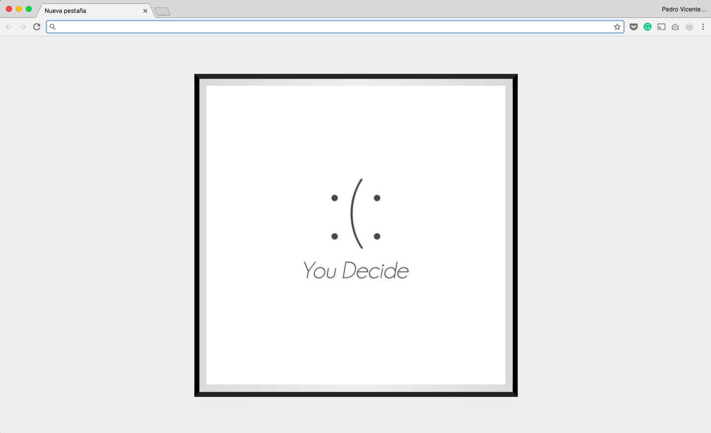

# Have a nice day - Chrome Extension

Chrome extension to generate smiles thanks to [https://github.com/pedrovgs/HaveANiceDay](https://github.com/pedrovgs/HaveANiceDay).

Replace your new tab page with some different and friendly messages changing everyday. We hope this extension will make you smile at least once a day :smiley:.

You can install the extension [here](https://chrome.google.com/webstore/detail/have-a-nice-day/comofccfnmfabkebjbofiahfpbcejaen).



### Executing tests:

This project contains some tests written using [Mocha](https://mochajs.org/). You can easily run the tests by executing:

```
yarn test //Executes every test.
yarn test -w //Waits for code changes and executes every test.
yarn test -g "String calculator spec*" //Executes tests matching with the regex passed as param.
```

If you are using IntelliJ IDEA, WebStorm or any other IDE to run your tests you'll need to configure the mocha execution options adding the following configuration:

```
--recursive --require ./test/bootload.js --require babel-register
```

This configuration is the same you can find in the project ``package.json`` configuration.

### Executing visual regression tests:

This project is configured to run some tests using a technique known as visual regression testing or screenshot testing. Using ``phantomxhr``, ``phantomjs``, ``casperjs``, and ``caspercss`` we are able to simulate server side responses and assert if the project UI shows the expected data to the user based on recorded screenshots. You can run these tests executing the following command:

```
yarn screenshot-test
```

These command will use the images found in the folder ``screenshots`` as baseline. If something changes in this command will break the build and you'll be able to review an image with the difference between the expected user interface and the new one.

### Running the extension:

To run this extension you can execute ``yarn webpack`` and import the extension as an "unpacked extension" or run ``yarn start`` and run the extension as a regular web page.

### Packaging:

This project uses [webpack](https://webpack.js.org) and [babel](https://babeljs.io) in order to pack a simple ``bundle.js`` file, with all the repository code, fully backward compatible with some old JavaScript versions. If you want to pack all this code into a single file you can easily do it by just running:

```
yarn webpack
```

This command generates a ``dist`` folder where all the code needed to pack the extension is placed. After executing this command you can export the chrome extension using the chrome development tools.

### Linter:

This repository uses [eslint](https://eslint.org/) in order to check if the js code written matches the checkstyle configured. You can check if everything is ok by executing ``yarn eslint src`` and automatically fix the issues by executing ``yarn eslint --fix src`` if needed.

Developed By
------------

* Pedro Vicente Gómez Sánchez - <pedrovicente.gomez@gmail.com>

<a href="https://x.com/pedro_g_s">
  
</a>
<a href="https://es.linkedin.com/in/pedrovgs">
  
</a>

License
-------

    Copyright 2017 Pedro Vicente Gómez Sánchez

    Licensed under the GNU General Public License, Version 3 (the "License");
    you may not use this file except in compliance with the License.
    You may obtain a copy of the License at

        http://www.gnu.org/licenses/gpl-3.0.en.html

    Unless required by applicable law or agreed to in writing, software
    distributed under the License is distributed on an "AS IS" BASIS,
    WITHOUT WARRANTIES OR CONDITIONS OF ANY KIND, either express or implied.
    See the License for the specific language governing permissions and
    limitations under the License.
